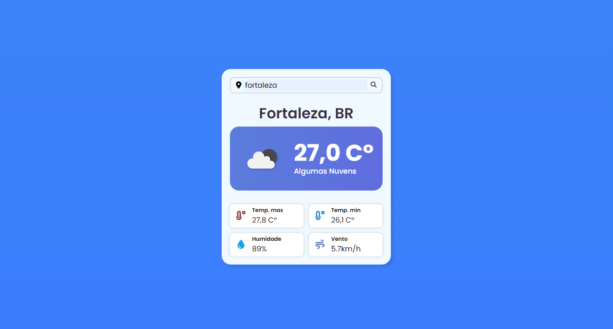

<h1 align="center">
  Weather App
</h1>

<h4 align="center"><a href="https://juniorod99.github.io/weather-api/" target="_blank">Clique para visitar o projeto</a></h4>

## 📚 Projeto

Uma lading page desenvolvida com o intuito de praticar as tecnologias e responsividade

## 💼 Tecnologias utilizadas

Para o desenvolvimento deste projeto utilizei as seguintes tecnologias:

- HTML;
- CSS;
- JavaScript;
- JQuery;
- Git e Github.

## 🤯 Aprendizado

Com o desenvolvimento desse projeto, aprendi a tecnicas de posicionamento com CSS e boas formas de utilizar Flexbox e Grid, e também a fazer a manipulação do DOM com JQuery.
